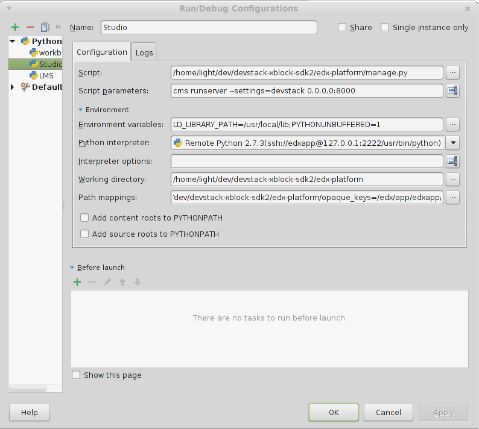

================================
Configuring your dev environment
================================

I was unsuccessful in many of my early attempts to setup a development environment (perhaps this was
due to my relative newbee status as a python developer).  What worked the best for me was to
run edx within a devstack virtual environment.

I started by following the tutorial found here devstackDev_.

This allows you to run edX in a devstack image and debug it through using pyCharm.  All python breakpoints will be honored.  If you need to debug the javascript, you should use the Google Chrome (or Firefox) debugger.

PyCharm is available here: pyCharm_

CMS Configuration
-----------------

LMS Configuration
-----------------

Workbench Configuration
-----------------------
If you want to run workbench in your devstack, you will have to:

    $ pip uninstall ora2

After you are done running in the workbench, you will have to re-install ora2 to get everything back to normal so you can run lms/studio:

    $ paver devstack lms

    $ paver devstack studio

pyCharm configuration:

Path Mappings (LMS/CMS/workbench):

Shapely python package
----------------------

Important - The serverside code worldmap.py uses topological calculations to evaluate user responses to see if they satisfy the geometric constraints as defined by the courseware author.
This facility uses the Shapely python package which requires the libgeos computations of the Java Topology Suite (JTS_)

1. install Shapely_, a python GIS package based on Java JTS library.

   $ pip install Shapely

2. Shapely version >= 1.4.3 is needed - if necessary, you will need to upgrade to 1.4:

   $ pip install --upgrade Shapely

.. _devstackDev: https://github.com/edx/edx-platform/wiki/Developing-on-the-edX-Developer-Stack
.. _pyCharm: http://www.jetbrains.com/pycharm/
.. _JTS: http://sourceforge.net/projects/jts-topo-suite/
.. _Shapely: http://toblerity.org/shapely