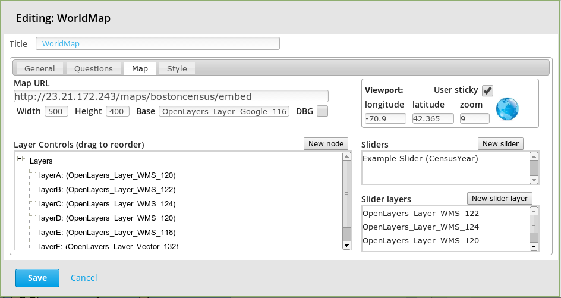

================================
Worldmap XBlock Adapter Overview
================================

  - Robert Light (light@alum.mit.edu)

XBlock is a component architecture for building courseware.  An XBlock is similar
in structure to web application "plugin" and fills a similar niche.  The Worldmap XBlock integration
attempts to seamlessly interface Harvard's Worldmap_ into the EdX XBlock architecture.

In this release we provide the following functionality:

1. Display of an interactive worldmap as a unit in an edX course.
2. Custom "prose" to be inserted above the map with live links that will cause the map to reframe and highlight a particular polyline, polygon or marker
3. A author-defined collapsable tree-based layer control to allow layers to have courseware-specific names as well as display the internal legends to the user.
4. Questions can be defined which require the user to respond by giving map-oriented answers (such as "draw a polygon around XYZ" or "draw a polyline which shows UVW" or "point to ABC")
5. The answers to these questions are judged based on a set of arbitrary constraints defined by the courseware author.
6. If the student does not answer the question in a specified number of tries, a "hint" is displayed.
7. There is also a "layer animation slider" which allows you to create simple animations of layers.  These animations may be time-based or some other parameter-based such as population density, income levels etc.

.. _Worldmap: http://worldmap.harvard.edu/

A simple worldmap unit
----------------------
The simplest worldmap edx "unit" might entail a map with a bit of explanation above it.  This might be the main "introductory" view

If the courseware author wishes, a link can be defined in the text which will pan/zoom the map dynamically to a new location and highlight some piece of geometry.
The courseware author can embed a simple link of the format:

    <a href='#' onclick='return highlight("[geo-name]",[duration],[relZoom])'>text-here</a>
       :geo-name: the name of the geometry (see below)
       :duration: the number of milliseconds the geometry is highlighted for the student
       :relZoom: the map is scrolled so that the highlighted geometry fills the screen, this value will be added/subtracted from this 'natural' value.
       :text-here: whatever you want your link to read to the student.

To highlight a layer use:
    <a href='#' onclick='return highlightLayer("[layerId]",[duration],[relZoom])'>text-here</a>

When the student clicks on the links, the map will scroll and zoom and either a layer, a polygon, polyline or a marker will
be displayed.

The geometries that can be highlighted on the map via the 'highlight' link can be defined via the "Referenced Geometry" list on the *General tab* of the configuration user interface (see below).

Assessments
-----------
For assessments, we wanted to give the ability to ask questions that require the student to go to the map and point at
something, draw a polygon or polyline as their answer.  Each answer is subjected to a series courseware author defined geometric "constraints"
that determine whether or not the student's answer is correct.  Each incorrect constraint debits a predefined amount of
``credit`` from the overall score for the question.  If the student answers the question incorrectly a predefined number of times,
a hint will be displayed showing him all the constraints that were not satisfied.

The reason we chose to have each incorrect constraint debit a percentage (from 100) is that it allows the courseware creator
to have, for example, two constraints each of which (if incorrect) results in a 100% wrong answer...or if a constraint is not
satisfied, each constraint might deduct 50% of the grade for that question...ie: it is up to the courseware creator.

Note that you can put *highlight links* in your question text in the same manner as you can for the prose above (see question #3 above).

Student's Answers & Constraints
-------------------------------

Each answer is evaluated based on a set of one or more geometric constraints.  The user's answer might be a point,
a polygon or a polyline.  The user's answer is evaluated based on several constraint types:

 * matches - does the drawn polygon or polyline match the correct geometry?
 * inside - is drawn polygon, polyline or point inside the constraint's polygon?
 * includes - does drawn polygon include the constraint's polygon, polyline or point?
 * excludes - does drawn polygon exclude the constraint's polygon, polyline or point?

The concept of "matches" involves an attribute *percentMatch* which determines how much overlap is required in order to be considered "matched".
Generally, a good value is between 50-65.

For all constraints, the attribute *percentOfGrade* defines how much of the grade is deducted if this constraint is *NOT* satisfied. (Note: the sum of all the *percentOfGrades* do not have have to add up to 100)

For user *point* responses, the only constraint available is "inside polygon" and there can be only one constraint defined (either the student hits or misses) and if the student misses the desired polygon, a 0% grade is assumed.

Note that for the user's drawn polygon, with the constraint: *includes* polygon or *includes* polyline, we require the courseware creator to define a "Max Area Ratio" which limits the user's polygon from being too big. (for example, if we didn't have the concept of a *Max Area Ratio* the student could draw a polygon around all of North America in response to the question "draw a polygon around the Boston area").

The specifics of each of these parameters, as well as how to define constraints will be detailed below where we describe the "Questions Tab" of the configuration dialog.

Layer Control
-------------

One of the problems with dealing with worldmap is that the layer names are defined by the map creator and may not be
appropriate to the educational task at hand - and possibly not even in the desired language and character set.  There also
might be many many more layers defined than are appropriate for the educational focus.

To solve this problem, we allow the courseware creator to define a "layer tree" control where each worldmap layer can be
defined to have a particular label (in the language and character set desired) and then organize those layer labels in a tree
structure.

If a group/folder checkbox is checked, then all layers inside the group are checked.  The group/folder checkbox is a tri-state
checkbox so if you uncheck one of the children, the group/folder checkbox will become "mixed".  Likewise, you can
uncheck everything within a folder by unchecking the folder.

Custom Sliders
--------------
One tool that might be of use in allowing a student to explore parameter based progressions in geographic data is the use of *sliders*.
For example, if you want to show the progression of population shifts over a period of time, or the changes in populaton density based on income level, you might
create a slider to allow the student to vary a parameter and have layers turned on & off based on the value of the slider.

The worldmap xblock adapter has the ability to define one or more sliders and position them on the 4 sides of the map to allow the student to explore this information in
a pseudo "animated" manner.

Configuration
-------------
When you create a new worldmap "unit" it comes pre-configured with the basics of a map unit.  This allows you to alter (or delete) any part of the
unit to fit your needs.  Programming detail: you can alter this "default configuration" by editing the static variables *configJson* and *worldmapConfigJson* in the file *worldmap.py*.

When you click the "Edit" button in edX/Studio (CMS) you will see the following screen:

The tabs are organized as follows:
   :General:  The prose html that introduces the map as well as any geometry that you would like highlighted as part of that prose.
   :Questions: All the questions (if any) associated with this map.
   :Map: All map-related information
   :Style: A css style sheet that you can use to customize the look and feel of your unit.  Note that it is possible to change the style of general Studio/LMS level ui entities from this style sheet - so you want to be careful here.

General Tab
-----------
The prose can be any arbitrary HTML and can contain generalized links to any internet resource.  In addition, you can have the map pan to a particular area and
highlight a piece of *reference geometry* (see below) by including the following link html:

    <a href='#' onclick='return highlight("[geo-name]",[duration],[relZoom])'>text-here</a>
       :geo-name: the name of the geometry (see below)
       :duration: the number of milliseconds the geometry is highlighted for the student
       :relZoom: the map is scrolled so that the highlighted geometry fills the screen, this value will be added/subtracted from this 'natural' value.
       :text-here: whatever you want your link to read to the student.

You can also highlight any layer by including the following link html:

    <a href='#' onclick='return highlightLayer("[layerId]",[duration],[relZoom])'>text-here</a>
       :layerId: the openlayer *id* of the layer you wish to highlight
       :duration: the number of milliseconds the layer is highlighted for the student
       :relZoom: the map is scrolled so that the highlighted geometry fills the screen, this value will be added/subtracted from this 'natural' value.
       :text-here: whatever you want your link to read to the student.

Reference Geometry:
If you have any links to reference geometry using the *highlight* link, then you need to define the piece of reference geometry.  Click the *Add a Reference* button to create piece of reference geometry.
A new item *new reference(unknown)* will be created - you now need to double click this entry to specify its details.

If you wish to delete this reference geometry, simply click the *Delete* button.

The *Unique Id* is the name by which you will use in your *highlight* anchor link.  You must specify whether you wish to specify a marker, polyline or polygon via the
radio buttons and then you must draw the required geometry.  To end drawing a polyline or a polygon, simply double-click on the final point.

Questions Tab
-------------
The questions tab lets you define the list of questions you would like the student to answer based on the map presented.  The questions can be created by clicking the *New Question* button and then can be
reordered by dragging the question rows around.

Each question needs a lot more definition.  You need to double-click on the question to set its details.  Here you will define the type of student-response
you are requesting from the student (ie: a map location, a polyline or a polygon) as well as how this response will be adjudicated (via geometric constraints).
The question detail screen looks like:

When the student is requested to specify a point location, the only constraint possible will be that the point lies within a polygon.  The constraint detail screen looks like this:

The *Hint Blur Padding* is a distance specified in meters that is used to create a type of "smudged" blot on the map when the student requests a "hint" to be displayed.  If you specify "0" you will get a crisp outline of the polygon, otherwise it is smudged using the distance specified.

The other items on the *Question Detail* dialog are as follows:
       :unique id: A unique id that differentiates this constraint from all other constraints on this question (note:  in the future, we may automatically generate this id)
       :tool button color: The color of the tool button expressed in RRGGBB html hex notation (note: do not prepend a '#' to this string)
       :# of attempts before hint: The number of failed attempts before the student is presented with a hint (use 0 to indicate that the student won't get any hint)
       :# of seconds to display hint: How long the hint should be displayed before being automatically hidden. (use 0 to indicate that it should stay up until the student closes the popup)
       :user's response to question: Whether the student must click a map location, specify a polyline or polygon.
       :list of constraints: These are the geometric constraints used to adjudicate the answer (see below).

Constraints
-----------
The answer to each question must be adjudicated by analyzing the student's graphical response to a set of one or more geometric constraints.  The types of constraints that we can handle are *matches*, *includes*, *excludes*, *inside*.
      :matches: Does the student-drawn geometry *match* the constraint's geometry.  Obviously, it can't *match* exactly, so this constraint has a parameter called *Percent match* which controls how close the student needs to be to be considered "correct".  Usually a value of 60-65 is appropriate here - experiment to see what is appropriate in judgement of the courseware creator.
      :inside:  Is the student drawn geometry wholely *inside* the constraint's geometry?
      :exclude: Is the student draw geometry wholely *outside* the constraint's geometry?
      :include: Is the student's drawn geometry cross the boundary of the constraint's geometry?

Not all constraint types are available for all response types, the controls will disable or a validation error will occur if the particular combination is not valid.

Map Tab
-------
The *Map Tab* contains all the map-related parameters such as where to find the worldmap, the viewport where it should be initially panned/zoomed to, whether there should be animation sliders etc.

The parameters required are as follows:
    :Map url:  The url of the worldmap *embed* - see worldmap documentation on how to get this url from an existing worldmap.
    :width:  The width of the worldmap in pixels
    :height: The height of the worldmap in pixels
    :base layer id: The openlayers id of the base layer you wish to use.  See below *finding openlayer ids*.
    :DBG:  Turn on/off the debugging window. See below.

Viewport specification:
    :click the globe: This let's you specify the map location and zoom interactively using the map defined.
    :longitude:  The longitude of the map viewport
    :latitude: The latitude of the map viewport.
    :zoom:  The zoom level
    :User sticky: If checked, when the user zooms or pans the map and then comes back to this unit later, the map will stay zoomed/panned to the previous location.  Unchecked, the map resets to the longitude/latitude/zoom defined above.

Layer controls:
    Each tree element can be moved around to a different location in the tree by drag-and-drop.  Each node defines a particular openlayer id.  See below *finding openlayer ids*.  If you do not want the layer control to be visible, open the layer detail dialog by double-clicking on the root label and uncheck it's visibility.

Slider controls:
    The user can specify any number of sliders which allow the student to slide display layers based on the value of a slider.  Each slider moves a courseware-author defined parameter within a numeric range.  The layers defined in the "slider layers" section each have one or more parameter values or parameter range values (min-max).  Based on the value of the slider, layers are turned on/off based on the value of the slider parameter.
    To create a slider, just click the "New Slider" button, then double-click on the slider to set its values.  To create a "Slider Layer", just click the "New Slider Layer" button.  (see the section on discovering *openlayer layer id* below).
    The slider detail dialog is shown below.

The slider parameters requested are:
   :Title: The title which appears on the slider
   :parameter: The parameter name the slider controls
   :position:  Where the slider will appear relative to the map (more than one slider can be on any given side)
   :minimum:  The minimum value for the slider
   :maximum:  The maximum value for the slider
   :increment: The increment value as the slider is moved by the user.
   :help: Any help (HTML) which you would like the slider to display in a mouseover.

Scoring
-------
A student's score is based on the score associated with each question.  The score for the entire unit is the average percentage score across all questions.  Each question's score is based on the number of constraints satisfied by the student's graphical answer.  The constraint scoring is somewhat odd in that each constraint *if not satisfied* subtracts a courseware-author's defined percentage from
the overall score for the question.  This allows the courseware author to have, for example, two constraints each of which needs to be satisified in order to get a 100% score on that question.
To do this, the *% deducted from score* for each question would be 100. If each of the two questions has equal weight - set each of the values to 50.

Styles Tab
----------
On the styles tab, you can create any stylesheet you want.  Be careful as these styles will be visible to the entire page and if you are not careful, you could change edX style properties.
The style properties that the courseware author would be interested in are the following:

    :.prose-area: The prose text above the map.
    :.questions-list: Affects the entire question list.
    :.question-text:  Affects only the question text.
    :.question-foobar: Affects only the question with the uniqueId of "foobar".
    :.question-score: Affects only the text which describes any problems associated with the student's answer
    :.slider-title: Affects only the text on a slider.
    :.slider-thumb-value: Affects only the text which appears showing the current value of the slider's thumb.
    :.dynatree-title:  Affects only the title of the layer name in the layer tree control.

